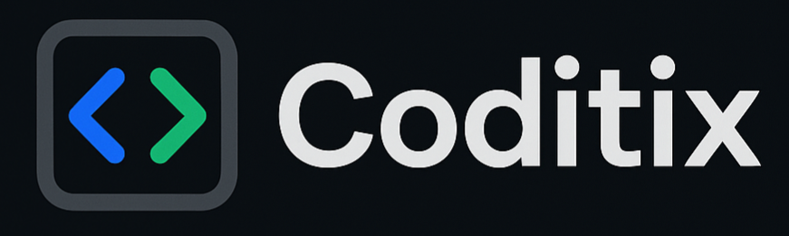
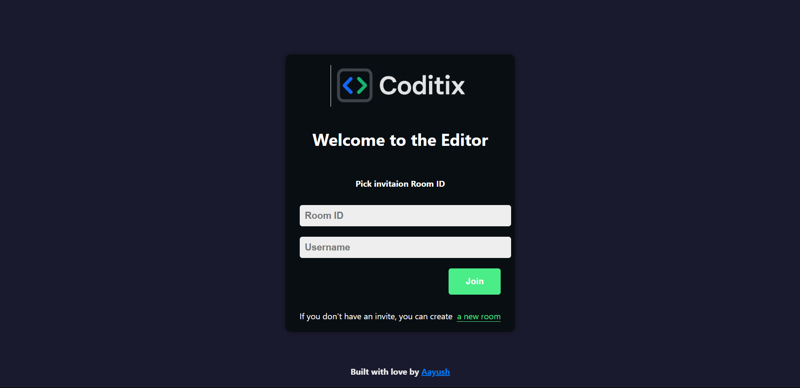
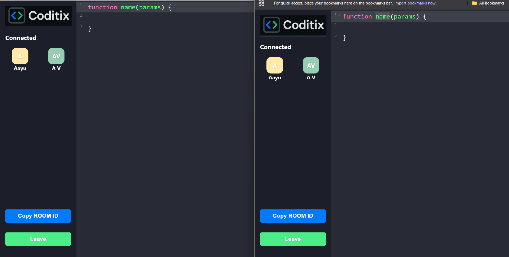
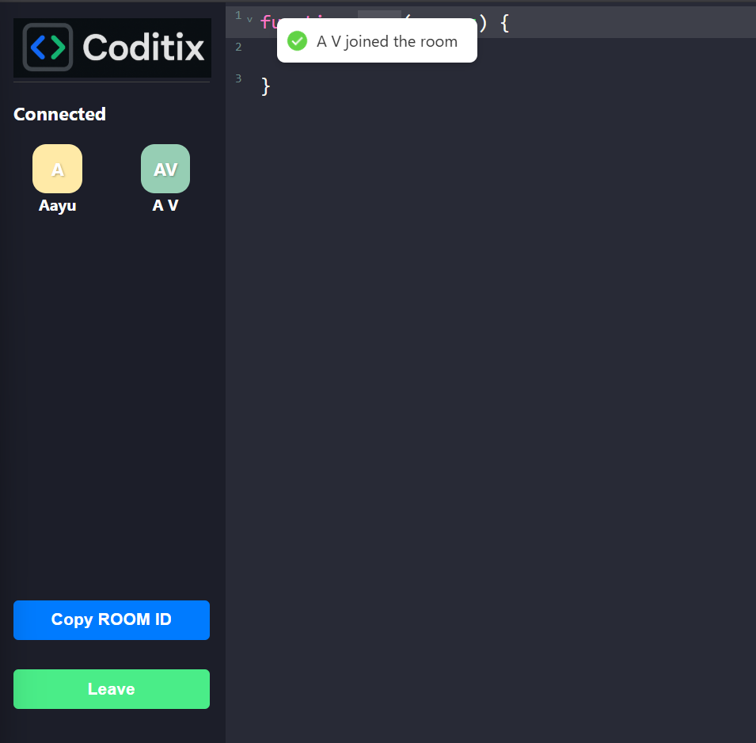

# Coditix – Realtime Collaborative Code Editor



**Coditix** is a fullstack real-time collaborative code editor that allows multiple users to join a shared room and edit code together with instant synchronization. Built with modern web technologies, it enables seamless live collaboration, making it ideal for coding interviews, teaching, pair programming, and hackathons.

---

## 🚀 Live Demo

👉 [Try Coditix Live](https://collaborative-code-editor-rho.vercel.app/)

> ⚙️ Backend hosted on [Render](https://coditix.onrender.com/)  
> 🌐 Frontend hosted on [Vercel](https://collaborative-code-editor-rho.vercel.app/)

---

## 🛠️ Tech Stack

### Frontend
- **React** (with Hooks)
- **CodeMirror 6** (via `@uiw/react-codemirror`)
- **React Router v7**
- **UUID** (for room IDs)
- **React Hot Toast** (notifications)
- **Custom CSS** (for layout and theming)

### Backend
- **Node.js**
- **Express.js**
- **Socket.IO** (WebSocket-based communication)

---

## 📂 Project Structure

```
Collaborative-Code-Editor/
├── public/                # Static assets (favicon, images, manifest)
├── src/
│   ├── assets/            # Logos and images
│   ├── components/        # Reusable UI components (Editor, Client)
│   ├── pages/             # React pages (Home, EditorPage)
│   ├── App.js             # App layout and routing
│   ├── App.css            # Main CSS and theming
│   ├── index.js           # React entry point
│   ├── socket.js          # Socket.io client logic
│   └── Actons.js          # Shared action constants
├── server.js              # Express + Socket.IO backend
├── render.yaml            # Render deployment config
├── package.json           # Project metadata and dependencies
├── README.md              # Project overview (this file)
└── ...
```

---

## ✨ Features

- 🔄 **Real-time code collaboration** using WebSockets
- 🔗 **Create or join rooms** with unique Room IDs
- 👥 **Live user list** with avatars and colors
- 📋 **Copy/share Room ID** with one click
- 🔔 **Toast notifications** on user actions
- ⚡ **Instant code synchronization** across all clients
- 🖥️ **Modern, responsive UI**

---

## 🧑‍💻 Getting Started

### 1. Clone the repository

```bash
git clone https://github.com/aayushhh07/Collaborative-Code-Editor.git
cd Collaborative-Code-Editor
```

### 2. Install dependencies (frontend & backend)

```bash
npm install
```

### 3. Run locally

Start Backend Server (Port 5000 by default):
```bash
node server.js
```

Start Frontend Dev Server (Port 5173 by default):
```bash
npm run dev
```

> The app will be available at `http://localhost:5173` (frontend) and `http://localhost:5000` (backend).

---

## 📸 Screenshots

### Room joining interface


### Live collaborative code editor in action


### Active toasts while joining


---

## 🤝 Contributing

Contributions, issues, and feature requests are welcome!

If you'd like to contribute, please follow these steps:

1. **Fork** the repository  
2. Create a new branch: `git checkout -b feature/YourFeatureName`  
3. Make your changes and **commit**: `git commit -m 'Add YourFeatureName'`  
4. **Push** to your forked repo: `git push origin feature/YourFeatureName`  
5. Open a **Pull Request**

Please make sure your code follows the project's coding conventions and includes relevant tests or examples where applicable.

---

## 👨‍💻 Author

**Aayush Vishwakarma**

- 📍 India    
- 🔗 [LinkedIn](https://www.linkedin.com/in/aayush-vishwakarma-68a8a92a1)  
- 💻 [GitHub](https://github.com/Aayushhh07)  
- 📬 Email: aayushvishwakarma93@gmail.com

---

## 📄 License

This project is licensed under the MIT License. See [LICENSE](LICENSE) for details.


