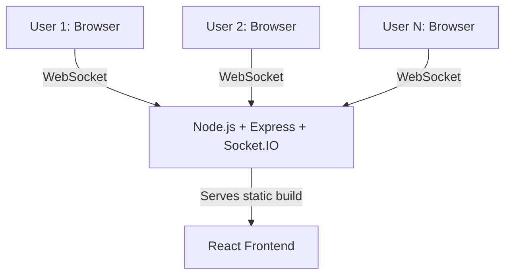

# 🚀 Coditix – Realtime Collaborative Code Editor


<p align="center">
  <b>Collaborate. Code. Create. In Real Time.</b><br>
  <i>Next-generation collaborative coding for interviews, teaching, pair programming, and more.</i>
</p>

<p align="center">
  <a href="https://collaborative-code-editor-rho.vercel.app/">🌐 Live Demo</a> |
  <a href="#-features">✨ Features</a> |
  <a href="#-quickstart">⚡ Quickstart</a> |
  <a href="#-architecture">🛠️ Architecture</a> |
  <a href="#-faq">❓ FAQ</a>
</p>

<p align="center">
  
  
  
  
  
</p>

---

## 📑 Table of Contents
- [About](#-about)
- [Features](#-features)
- [Screenshots](#-screenshots)
- [Quickstart](#-quickstart)
- [Architecture](#-architecture)
- [Tech Stack](#-tech-stack)
- [FAQ](#-faq)
- [Contributing](#-contributing)
- [Author](#-author)
- [License](#-license)

---

## 🧐 About
**Coditix** is a modern, fullstack collaborative code editor that lets multiple users join a shared room and edit code together in real time. Whether you're conducting interviews, teaching, pair programming, or hacking together, Coditix delivers a seamless, instant, and delightful experience.

---

## ✨ Features

- 🔄 **Real-Time Collaboration**: See code changes from all users instantly, powered by WebSockets.
- 🔗 **Room System**: Create or join rooms with unique IDs—no signup required.
- 👥 **Live User List**: See who's online, with colorful avatars and usernames.
- 📋 **Easy Sharing**: Copy/share Room ID with a single click.
- 🔔 **Smart Notifications**: Toasts for join/leave/copy actions.
- 🖥️ **Modern UI**: Responsive, dark-themed, and accessible.
- 📝 **CodeMirror 6 Editor**: Syntax highlighting, smooth editing, and extensible.
- 🚀 **Zero Setup**: No database, no config—just run and code.
- 🛡️ **Secure & Private**: No code is stored after all users leave a room.

---

## 🖼️ Screenshots

| Home / Join Room | Collaborative Editor | Toast Notifications |
|:---:|:---:|:---:|
|  |  |  |

---

## ⚡ Quickstart

### 1. Clone & Install
```bash
git clone https://github.com/aayushhh07/Collaborative-Code-Editor.git
cd Collaborative-Code-Editor
npm install
```

### 2. Run Locally
- **Backend**: `node server.js` (default port 5000)
- **Frontend**: `npm run dev` (default port 5173)

> Open [http://localhost:5173](http://localhost:5173) in your browser.

### 3. Try It Out
- Create a room, share the Room ID, and start coding together!

---

## 🛠️ Architecture



- **Frontend**: React SPA, CodeMirror editor, socket.io-client for real-time updates.
- **Backend**: Node.js/Express server, socket.io for WebSocket communication, in-memory state for rooms and code.
- **Communication**: WebSocket (Socket.IO) for all real-time events (join, code change, sync, disconnect).

---

## 🧩 Tech Stack

- **Frontend**: React, CodeMirror 6, React Router v7, React Hot Toast, Custom CSS
- **Backend**: Node.js, Express.js, Socket.IO
- **Other**: UUID (room IDs), Render/Vercel (deployment)

---

## ❓ FAQ

**Q: Is my code stored anywhere?**
- No. Code is only kept in memory while users are in a room. When all users leave, it's gone.

**Q: Can I use this for interviews or teaching?**
- Absolutely! Coditix is designed for collaborative sessions, interviews, and classrooms.

**Q: Can I add more languages or features?**
- Yes! See [TECHNICAL_README.md](TECHNICAL_README.md) for extensibility tips.

**Q: Is it open source?**
- Yes, and contributions are welcome!

---

## 🤝 Contributing

We love contributions! To get started:
1. **Fork** the repo
2. **Create a branch**: `git checkout -b feature/YourFeature`
3. **Commit** your changes
4. **Push** and **open a Pull Request**

Please follow code style, add comments, and test your changes. See [TECHNICAL_README.md](TECHNICAL_README.md) for more.

---

## 👨‍💻 Author

**Aayush Vishwakarma**
- 📍 India
- [LinkedIn](https://www.linkedin.com/in/aayush-vishwakarma-68a8a92a1)
- [GitHub](https://github.com/Aayushhh07)
- 📬 aayushvishwakarma93@gmail.com

---

## 📄 License

This project is licensed under the MIT License. See [LICENSE](LICENSE) for details.

---

<p align="center">
  <b>Made with ❤️ for the collaborative future of coding.</b>
</p>


